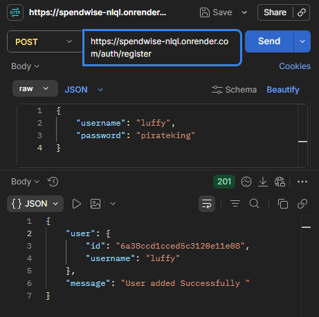
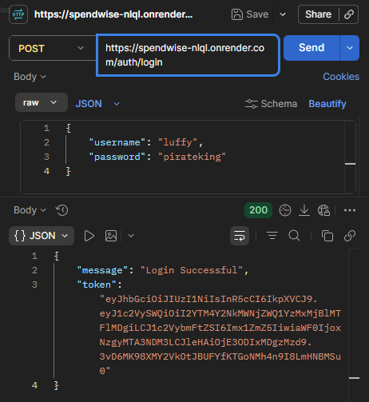
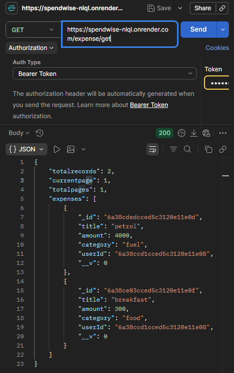
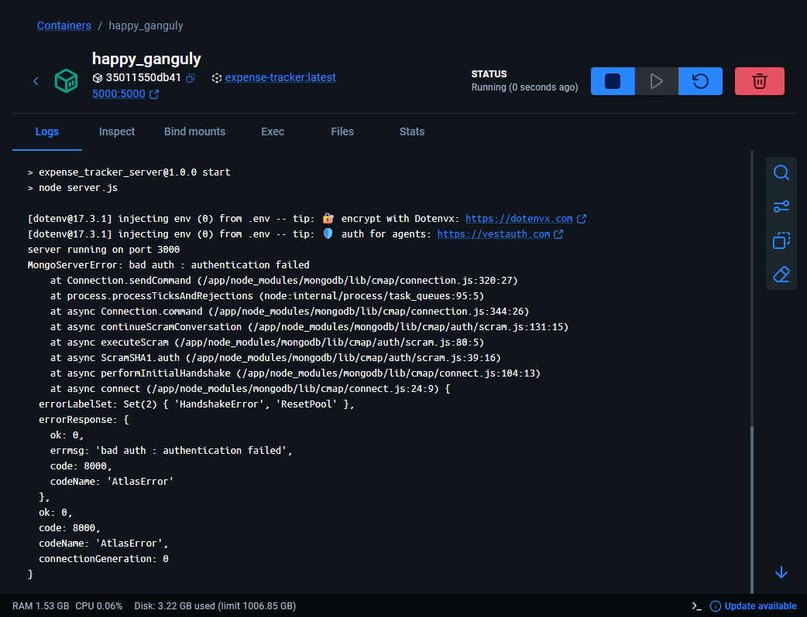

# 💰 SpendWise API

<p align="center">
  
</p>

A secure and scalable RESTful Expense Tracker API built with **Node.js**, **Express.js**, and **MongoDB**. It enables users to register, authenticate using JWT, and manage their personal expenses through protected API endpoints.

The project follows the **MVC architecture**, implements secure authentication using **bcrypt** and **JWT**, and is fully containerized using **Docker** for consistent development and deployment.

---

## 🚀 Features

- 🔐 User Registration & Login
- 🔑 JWT Authentication
- 🔒 Password Hashing using bcrypt
- 📊 Expense CRUD Operations
- 📄 Pagination
- 🔍 Filtering Expenses
- 🛡 Protected Routes
- 🏗 MVC Project Structure
- 🐳 Docker & Docker Compose Support
- 🌐 Ready for Deployment (Render)

---

# 🏗 System Architecture

```
                    Client
                       │
                 HTTP Request
                       │
               Express Server
                       │
               JWT Authentication
                       │
                Route Handlers
                       │
                 Controllers
                       │
                    Models
                       │
                   MongoDB
```

---

# 🛠 Tech Stack

| Category | Technology |
|----------|------------|
| Backend | Node.js |
| Framework | Express.js |
| Database | MongoDB |
| ODM | Mongoose |
| Authentication | JWT |
| Password Security | bcrypt |
| Containerization | Docker |
| API Testing | Postman |
| Deployment | Render |

---

# 📂 Project Structure

```
SpendWise/
│
├── config/
│
├── controllers/
│   ├── auth.controller.js
│   └── expense.controller.js
│
├── middleware/
│   └── auth.middleware.js
│
├── models/
│   ├── User.js
│   └── Expense.js
│
├── routes/
│   ├── auth.route.js
│   └── expense.route.js
│
├── assets/
│   ├── banner.png
│   ├── register.png
│   ├── login.png
│   ├── expenses.png
│   └── docker.png
│
├── Dockerfile
├── docker-compose.yml
├── package.json
├── server.js
└── .env.example
```

---

# 📸 Project Preview

## User Registration

<p align="center">

</p>

---

## User Login

<p align="center">

</p>

---

## Expense Management

<p align="center">

</p>

---

## Docker Container

<p align="center">

</p>

---

# 📡 API Endpoints

## Authentication

| Method | Endpoint | Description |
|---------|----------|-------------|
| POST | `/auth/register` | Register a new user |
| POST | `/auth/login` | Login user |

---

## Expenses

| Method | Endpoint | Description |
|---------|----------|-------------|
| GET | `/expenses` | Get all expenses |
| POST | `/expenses` | Add expense |
| DELETE | `/expenses/:id` | Delete expense |

---

## Protected Routes

All expense routes require a JWT.

Add the token in the request header:

```
Authorization: Bearer <your_jwt_token>
```

---

# ⚙ Environment Variables

Create a `.env` file.

```
PORT=3000

MONGO_URI=your_mongodb_connection_string

JWT_SECRET=your_secret_key
```

---

# 🐳 Run Using Docker

Clone the repository

```bash
git clone https://github.com/yourusername/SpendWise.git
```

Move into the project

```bash
cd SpendWise
```

Build and start the containers

```bash
docker compose up --build
```

The API will be available at

```
http://localhost:3000
```

To stop the containers

```bash
docker compose down
```

---

# 💻 Run Locally (Without Docker)

Clone the repository

```bash
git clone https://github.com/yourusername/SpendWise.git
```

Navigate to the project

```bash
cd SpendWise
```

Install dependencies

```bash
npm install
```

Create a `.env` file.

Start the server

```bash
npm start
```

or

```bash
node server.js
```

---

# 🧪 Testing the API

You can test the API using:

- Postman
- Thunder Client
- Insomnia

Workflow:

1. Register a user
2. Login
3. Copy the JWT
4. Add it to

```
Authorization: Bearer <token>
```

5. Access protected endpoints.

---

# 🔒 Security Features

- Passwords hashed using bcrypt
- JWT-based authentication
- Protected routes
- Environment variables
- User-specific expense access
- Invalid token handling

---

# 📚 Concepts Demonstrated

- REST API Development
- MVC Architecture
- Express Middleware
- JWT Authentication
- Password Hashing
- MongoDB Relationships
- Pagination
- Filtering
- Error Handling
- Docker Containerization
- Environment Variable Management

---

# 🚀 Future Improvements

- ✏ Update Expense Endpoint
- 📅 Filter by Date Range
- 📈 Expense Analytics Dashboard
- 📊 Charts & Reports
- 📄 Swagger API Documentation
- 🧪 Unit & Integration Tests
- ⚙ GitHub Actions CI/CD
- ⚛ React Frontend

---

## ⭐ If you found this project helpful, consider giving it a star!